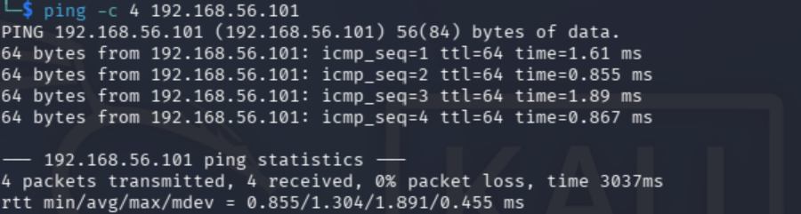
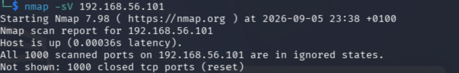
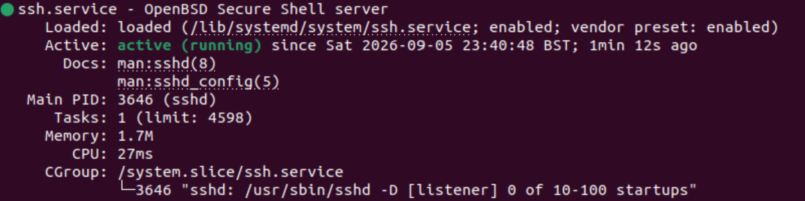

# Linux SSH Service Verification Lab

## Overview

A small Linux and networking self-study lab using two virtual machines (VMs) in VirtualBox. I used Kali to check the network connection and scan Ubuntu. I then installed an SSH server on Ubuntu, checked that port 22 was open, and stopped and disabled SSH when I no longer needed it. Finally, I scanned Ubuntu again to check the change.

## Objective

Learn how to connect two Linux VMs, manage a service, and check the result from another machine.

## Lab environment

| VM | Role | Adapter 1 | Adapter 2 host-only IP |
| --- | --- | --- | --- |
| Kali Linux | Connectivity checks and scanning | NAT for internet access | 192.168.56.102 |
| Ubuntu Linux | Target and SSH service management | NAT for internet access | 192.168.56.101 |

Both VMs used the same VirtualBox Host-Only Adapter for Adapter 2. Tools used were `ip`, `ping`, Nmap, `apt` and `systemctl`.

## Network layout

```text
                        Internet
                       /        \
              VirtualBox NAT  VirtualBox NAT
                (Adapter 1)    (Adapter 1)
                     |              |
                  Kali VM       Ubuntu VM
              192.168.56.102   192.168.56.101
                (Adapter 2)    (Adapter 2)
                     |              |
                     +--------------+
                    Shared host-only network
                        192.168.56.0/24
```

Each VM kept Adapter 1 set to NAT for internet access. Adapter 2 connected the VMs to the same host-only network so they could communicate with each other. The IP addresses shown above belong to Adapter 2.

## Steps performed

1. Used Kali and Ubuntu VMs in VirtualBox and checked their IP addresses with `ip a`. Both initially showed `10.0.2.15`, but each VM had its own NAT connection. They needed a shared network to communicate with each other.
2. Kept Adapter 1 as NAT for internet access and added Adapter 2 using the same Host-Only Adapter on both VMs. Ubuntu had `192.168.56.101` and Kali had `192.168.56.102`.
3. From Kali, ran `ping -c 4 192.168.56.101`. All four packets were received, with 0% packet loss.
4. Ran `nmap -sV 192.168.56.101` from Kali. The host was up, but all 1,000 default TCP ports scanned were closed.
5. On Ubuntu, ran `systemctl status ssh --no-pager`. It reported `Unit ssh.service could not be found.`
6. Ran `sudo apt update` and `sudo apt install openssh-server -y` on Ubuntu. I checked the service again: it showed `Active: active (running)` and was listening on port 22.
7. Repeated the Nmap scan from Kali. TCP port 22 was open and identified as SSH/OpenSSH.
8. Because SSH was no longer required for the lab, ran `sudo systemctl stop ssh` and `sudo systemctl disable ssh` on Ubuntu. Checked the service status again and confirmed it was no longer running.
9. Repeated the same Nmap scan from Kali. The final scan confirmed that port 22 was no longer open.

## Key commands

On Kali:

```bash
ping -c 4 192.168.56.101
nmap -sV 192.168.56.101
```

On Ubuntu, to check and install SSH:

```bash
systemctl status ssh --no-pager
sudo apt update
sudo apt install openssh-server -y
systemctl status ssh --no-pager
```

On Ubuntu, after the scan showed SSH was open:

```bash
sudo systemctl stop ssh
sudo systemctl disable ssh
systemctl status ssh --no-pager
```

See [the command notes](notes/commands.md) for all commands used and their explanations, including `ip a`.

## Results

This table summarises what I recorded during the lab.

| Check | Observed result |
| --- | --- |
| Connectivity from Kali to Ubuntu | 4 packets transmitted, 4 received, 0% packet loss |
| Initial Nmap scan | Host up; all 1,000 default TCP ports scanned were closed |
| Initial Ubuntu service check | `ssh.service` could not be found |
| After installing OpenSSH server | SSH service active and running; listening on port 22 |
| Nmap scan with SSH running | TCP port 22 open; SSH/OpenSSH identified |
| After stopping and disabling SSH | Service no longer running; final scan showed port 22 was no longer open |

## What I learned

- NAT gave each VM internet access. The shared host-only network let the VMs communicate with each other.
- An open port is not automatically a vulnerability. I need to understand which service is using it and whether that service is required.
- Stopping a service stops it now. Disabling it removes its normal automatic startup setting; disabling alone does not stop a running service.
- Checking SSH on Ubuntu and scanning from Kali gave me two ways to check the change.

My main lesson was to make a controlled change, then check from another machine that it had worked.

## Screenshots

These screenshots are from the lab completed on 5 September 2026. I cropped out identifying details and unrelated content. The command output shown is unchanged.

### Connectivity from Kali



The ping result confirms Ubuntu was reachable at `192.168.56.101`.

### Initial Nmap scan



Before installing the SSH server, all 1,000 default TCP ports scanned were closed.

### SSH service running on Ubuntu



This shows SSH running on Ubuntu after installation. I recorded the later Nmap results in messages, but did not attach screenshots of those scans.

## Limitations / scope

- This was a Linux and networking self-study lab. It was not penetration testing or a vulnerability assessment. I did not exploit anything.
- I scanned only Ubuntu's host-only IP address. The scan checked the default 1,000 TCP ports, not all TCP ports or UDP ports.
- Nmap identified SSH/OpenSSH. I have not included an exact version or treated the open SSH port as a vulnerability.
